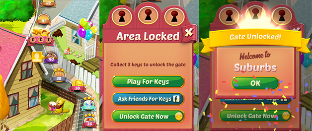

# AB-testing-GameDesign

I designed an experiment to test the conversion rate of two different levels in a mobile game.
I use a boostraping technique to generate random data and iterating over the diferents rates and knowing the probability 
of which one will generate more conversiton.

